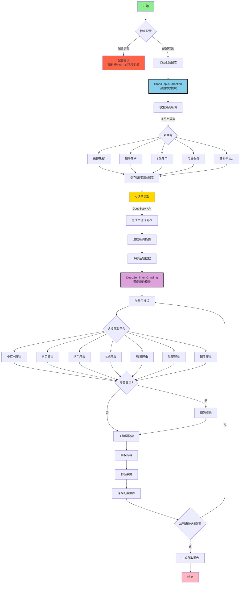

> [!warning]
> 好像最近项目中用来请求每日热点新闻的api接口被ban了，可以自己部署一下[newsnow](https://github.com/ourongxing/newsnow)，很快的可以一键部署，然后替换掉这个URL即可，最近一个月我也会commit一版更通用的解决方案。
> ```python
> #新闻API基础URL
> BASE URL = "https://newsnow.busiyi.world"
> ```

# MindSpider - 专为舆情分析设计的AI爬虫

> 免责声明：
> 本仓库的所有内容仅供学习和参考之用，禁止用于商业用途。任何人或组织不得将本仓库的内容用于非法用途或侵犯他人合法权益。本仓库所涉及的爬虫技术仅用于学习和研究，不得用于对其他平台进行大规模爬虫或其他非法行为。对于因使用本仓库内容而引起的任何法律责任，本仓库不承担任何责任。使用本仓库的内容即表示您同意本免责声明的所有条款和条件。

## 项目概述

MindSpider是一个基于Agent技术的智能舆情爬虫系统，通过AI自动识别热点话题，并在多个社交媒体平台进行精准的内容爬取。系统采用模块化设计，能够实现从话题发现到内容收集的全自动化流程。

该部分学习借鉴github知名爬虫项目[MediaCrawler](https://github.com/NanmiCoder/MediaCrawler)

两步走爬取：

- 模块一：Search Agent从包括微博、知乎、github、酷安等 **13个** 社媒平台、技术论坛识别热点新闻，并维护一个每日话题分析表。
- 模块二：全平台爬虫深度爬取每个话题的细粒度舆情反馈。

<div align="center">


MindSpider 运行示例
</div>

### 技术架构

- **编程语言**: Python 3.9+
- **AI框架**: 默认Deepseek，可以接入多种api (话题提取与分析)
- **爬虫框架**: Playwright (浏览器自动化)
- **数据库**: MySQL / PostgreSQL (数据持久化存储)
- **并发处理**: AsyncIO (异步并发爬取)
- **配置管理**: 统一使用 `.env` 环境变量配置

## 项目结构

```
MindSpider/
├── BroadTopicExtraction/           # 话题提取模块
│   ├── database_manager.py         # 数据库管理器
│   ├── get_today_news.py          # 新闻采集器
│   ├── main.py                    # 模块主入口
│   └── topic_extractor.py         # AI话题提取器
│
├── DeepSentimentCrawling/         # 深度爬取模块
│   ├── keyword_manager.py         # 关键词管理器
│   ├── main.py                   # 模块主入口
│   ├── platform_crawler.py       # 平台爬虫管理器
│   └── MediaCrawler/             # 多平台爬虫核心
│       ├── base/                 # 基础类
│       ├── cache/                # 缓存系统
│       ├── config/               # 配置文件
│       ├── media_platform/       # 各平台实现
│       │   ├── bilibili/        # B站爬虫
│       │   ├── douyin/          # 抖音爬虫
│       │   ├── kuaishou/        # 快手爬虫
│       │   ├── tieba/           # 贴吧爬虫
│       │   ├── weibo/           # 微博爬虫
│       │   ├── xhs/             # 小红书爬虫
│       │   └── zhihu/           # 知乎爬虫
│       ├── model/               # 数据模型
│       ├── proxy/               # 代理管理
│       ├── store/               # 存储层
│       └── tools/               # 工具集
│
├── schema/                       # 数据库架构
│   ├── db_manager.py            # 数据库管理
│   ├── init_database.py         # 初始化脚本
│   └── mindspider_tables.sql    # 表结构定义
│
├── add_custom_topic.py          # 自定义话题添加工具
├── check_crawled_data.py        # 数据检查工具
├── config.py                    # 全局配置文件
├── main.py                      # 系统主入口
├── requirements.txt             # 依赖列表
└── README.md                    # 项目文档
```

## 系统工作流程

### 整体架构流程图



### 工作流程说明

#### 1. BroadTopicExtraction（话题提取模块）

该模块负责每日热点话题的自动发现和提取：

1. **新闻采集**：从多个主流平台（微博、知乎、B站等）自动采集热点新闻
2. **AI分析**：使用DeepSeek API对新闻进行智能分析
3. **话题提取**：自动识别热点话题并生成相关关键词
4. **数据存储**：将话题和关键词保存到MySQL数据库

#### 2. DeepSentimentCrawling（深度爬取模块）

基于提取的话题关键词，在各大社交平台进行深度内容爬取：

1. **关键词加载**：从数据库读取当日提取的关键词
2. **平台爬取**：使用Playwright在7大平台进行自动化爬取
3. **内容解析**：提取帖子、评论、互动数据等
4. **情感分析**：对爬取内容进行情感倾向分析
5. **数据持久化**：将所有数据结构化存储到数据库

## 数据库架构

### 核心数据表

1. **daily_news** - 每日新闻表
   - 存储从各平台采集的热点新闻
   - 包含标题、链接、描述、排名等信息

2. **daily_topics** - 每日话题表
   - 存储AI提取的话题和关键词
   - 包含话题名称、描述、关键词列表等

3. **topic_news_relation** - 话题新闻关联表
   - 记录话题与新闻的关联关系
   - 包含关联度得分

4. **crawling_tasks** - 爬取任务表
   - 管理各平台的爬取任务
   - 记录任务状态、进度、结果等

5.### 支持的平台

| 平台 | 状态 | 说明 |
|------|------|------|
| **B站 (Bilibili)** | ✅ 正常 | 视频、评论，无需登录 |
| **微博 (Weibo)** | ⚠️ 反爬虫 | HTTP 432错误，Cookie易过期，需频繁重新登录 |
| **小红书 (XHS)** | ✅ 可用 | 笔记、评论，需要登录 |
| **抖音 (Douyin)** | ✅ 可用 | 视频、评论，需要登录 |
| **快手 (Kuaishou)** | ✅ 可用 | 视频、评论，需要登录 |
| **知乎 (Zhihu)** | ✅ 可用 | 问答、评论，需要登录 |
| **贴吧 (Tieba)** | ✅ 可用 | 帖子、评论，需要登录 |

**推荐使用**：B站（最稳定，无需登录）

**微博问题说明**：
- 微博有强反爬虫机制（HTTP 432错误）
- Cookie有效期短（1-7天），需要频繁重新登录
- 解决方案：删除 `cookies/weibo_cookies.json` 后重新扫码登录
- 详细文档：参见 `docs/MindSpider微博HTTP432错误解决方案.md`

   - xhs_note - 小红书笔记
   - douyin_aweme - 抖音视频
   - kuaishou_video - 快手视频
   - bilibili_video - B站视频
   - weibo_note - 微博帖子
   - tieba_note - 贴吧帖子
   - zhihu_content - 知乎内容

## 安装部署

### 环境要求

- Python 3.9 或更高版本
- 数据库：MySQL 5.7+ 或 PostgreSQL 12+（二选一）
- Conda环境：pytorch_python11（推荐）
- 操作系统：Windows/Linux/macOS
- 浏览器：Chrome 或 Edge（用于爬虫）

### 1. 克隆项目

```bash
git clone https://github.com/yourusername/MindSpider.git
cd MindSpider
```

### 2. 创建并激活环境

#### Conda配置方法

#### Conda配置方法

```bash
# 创建名为 pytorch_python11 的conda环境并指定Python版本
conda create -n pytorch_python11 python=3.11
# 激活该环境
conda activate pytorch_python11
```

#### UV配置方法

> [UV 是一种快速轻量级 Python 包环境管理工具，适用于低依赖及便捷管理需求。可参考：https://github.com/astral-sh/uv]

- 安装uv（如未安装）
```bash
pip install uv
```
- 创建虚拟环境并激活
```bash
uv venv --python 3.11 # 创建3.11环境
source .venv/bin/activate   # Linux/macOS
# 或
.venv\Scripts\activate      # Windows
```


### 3. 安装依赖

```bash
# 安装Python依赖
pip install -r requirements.txt

或
# uv版本更加快速
uv pip install -r requirements.txt


# 安装Playwright浏览器驱动
playwright install
```

### 4. 配置系统

**重要：MindSpider使用统一的环境变量配置管理**

复制 `.env.example` 文件为 `.env` 文件，放置在**项目根目录**（`d:\Python-Learning\bettafish\.env`）。

编辑 `.env` 文件，设置数据库和API配置：

```bash
# ====================== 数据库配置 ======================
# 数据库主机地址
DB_HOST=localhost
# 数据库端口号（MySQL默认3306，PostgreSQL默认5432）
DB_PORT=5432
# 数据库用户名
DB_USER=bettafish
# 数据库密码
DB_PASSWORD=bettafish_2024
# 数据库名称
DB_NAME=bettafish
# 数据库字符集
DB_CHARSET=utf8mb4
# 数据库类型：mysql 或 postgresql
DB_DIALECT=postgresql

# ====================== AI API配置 ======================
# MindSpider AI API（用于话题提取）
MINDSPIDER_BASE_URL=https://api.deepseek.com/v1
MINDSPIDER_API_KEY=sk-your-deepseek-key
MINDSPIDER_MODEL_NAME=deepseek-chat
```

**配置说明**：
- 所有配置项都从 `.env` 文件读取
- MindSpider主项目和MediaCrawler子项目共享同一配置
- 支持MySQL和PostgreSQL两种数据库
- 修改配置后无需修改代码，重启即可生效

### 5. 初始化系统

```bash
# 检查系统状态
python main.py --status

# 初始化数据库表
python main.py --setup
```

## 使用指南

### 快速开始工作流

```bash
# 步骤1：检查系统状态和配置
python main.py --status

# 步骤2：添加自定义话题（可选）
python add_custom_topic.py "小米汽车分析" "小米汽车,小米SU7,电动车"

# 步骤3：运行话题提取（获取热点新闻和关键词）
python main.py --broad-topic

# 步骤4：运行爬虫（基于关键词爬取各平台内容）
python main.py --deep-sentiment --platforms bili --test

# 步骤5：检查爬取结果
python check_crawled_data.py

# 或者一次性运行完整流程
python main.py --complete --test
```

### 完整流程

```bash
# 1. 运行话题提取（获取热点新闻和关键词）
python main.py --broad-topic

# 2. 运行爬虫（基于关键词爬取各平台内容）
# 读取数据库中“今日（或 --date 指定）”的话题关键词；
# 启动各平台爬虫（受 --platforms 控制，默认配置文件里启用的平台），抓取内容与评论；
# 不会重新提取话题，也不会生成最终报告。
python main.py --deep-sentiment --test

#一次性运行完整流程
# 先跑 BroadTopicExtraction，从资讯源生成/更新当日 daily_topics；
# 再自动调用 DeepSentimentCrawling（等同于前一个命令）；
# 若配置了后续流程，还会触发 Report/Forum 等后续引擎（在 --test 模式下通常使用最小参数）。
python main.py --complete --test
```

### 单独使用模块

```bash
# 只获取今日热点和关键词
python main.py --broad-topic

# 只爬取特定平台
python main.py --deep-sentiment --platforms xhs dy --test

# 指定日期
python main.py --broad-topic --date 2024-01-15
```

## 爬虫配置（重要）

### 平台登录配置

**首次使用每个平台都需要登录，这是最关键的步骤：**

1. **小红书登录**
```bash
# 测试小红书爬取（会弹出二维码）
python main.py --deep-sentiment --platforms xhs --test
# 用小红书APP扫码登录，登录成功后会自动保存状态
```

2. **抖音登录**
```bash
# 测试抖音爬取
python main.py --deep-sentiment --platforms dy --test
# 测试抖音爬取，指定日期   
python main.py --deep-sentiment --platforms dy --date 2025-11-17 --test
# 用抖音APP扫码登录
```

3. **其他平台同理**
```bash
# 快手
python main.py --deep-sentiment --platforms ks --test

# B站
python main.py --deep-sentiment --platforms bili --test

# 微博
python main.py --deep-sentiment --platforms wb --test

# 贴吧
python main.py --deep-sentiment --platforms tieba --test

# 知乎
python main.py --deep-sentiment --platforms zhihu --test
```
### 登录问题排除

**如果登录失败或卡住：**

1. **检查网络**：确保能正常访问对应平台
2. **关闭无头模式**：编辑 `DeepSentimentCrawling/MediaCrawler/config/base_config.py`
   ```python
   HEADLESS = False  # 改为False，可以看到浏览器界面
   ```
3. **手动处理验证**：有些平台可能需要手动滑动验证码
4. **重新登录**：删除 `DeepSentimentCrawling/MediaCrawler/browser_data/` 目录重新登录

### 爬取参数调整

在实际使用前建议调整爬取参数：

```bash
# 小规模测试（推荐先这样测试）
python main.py --complete --test

# 调整爬取数量
python main.py --complete --max-keywords 20 --max-notes 30
```

### 高级功能

#### 1. 自定义话题管理

使用 `add_custom_topic.py` 管理自定义话题：

**添加话题**：
```bash
# 基本用法
python add_custom_topic.py "话题名称" "关键词1,关键词2,关键词3"

# 示例：添加小米汽车话题
python add_custom_topic.py "小米汽车分析" "小米汽车,小米SU7,电动车"

# 示例：添加AI技术话题
python add_custom_topic.py "AI技术趋势" "人工智能,ChatGPT,大模型,AI应用"

# 带描述的话题
python add_custom_topic.py "新能源汽车" "电动车,充电桩,续航" "新能源汽车市场分析"
```

**查看所有话题**：
```bash
# 列出数据库中的所有话题
python add_custom_topic.py --list
```

**删除话题**：
```bash
# 按话题名称删除
python add_custom_topic.py --delete "小米汽车分析"

# 按话题ID删除
python add_custom_topic.py --delete-id "custom_20251117_140530"

# 查看帮助
python add_custom_topic.py --help
```

**功能说明**：
- ✅ 添加话题：自动生成话题ID，支持多个关键词
- ✅ 查看话题：列出所有话题及其关键词、状态
- ✅ 删除话题：支持按名称或ID删除，需确认
- ✅ 自动保存到 `daily_topics` 表
- ✅ 添加后可直接用于爬取

**查看话题示例输出**：
```
================================================================================
话题列表
================================================================================

1. 小米汽车分析
   ID: custom_20251117_140530
   关键词: 小米汽车, 小米SU7, 电动车
   日期: 2025-11-17
   状态: pending

2. AI技术趋势
   ID: custom_20251117_141205
   关键词: 人工智能, ChatGPT, 大模型, AI应用
   日期: 2025-11-17
   状态: pending

================================================================================
总计: 2 个话题
================================================================================
```

**删除话题示例输出**：
```bash
$ python add_custom_topic.py --delete "小米汽车分析"

即将删除以下话题:
  话题名称: 小米汽车分析
  话题ID: custom_20251117_140530
  关键词: 小米汽车, 小米SU7, 电动车

确认删除该话题吗？(yes/no): yes

删除成功!
已删除话题: 小米汽车分析
```

#### 2. 检查和管理爬取数据

使用 `check_crawled_data.py` 查看和管理已爬取的数据：

**查看所有平台数据统计**：
```bash
# 查看所有平台的数据汇总
python check_crawled_data.py
```

**查看指定平台数据**：
```bash
# 查看B站数据
python check_crawled_data.py --platform bili

# 查看微博数据
python check_crawled_data.py --platform weibo

# 查看小红书数据
python check_crawled_data.py --platform xhs

# 支持的平台：bili, weibo, xhs, douyin, kuaishou, tieba, zhihu
```

**清空数据**：
```bash
# 清空B站所有数据（需要确认）
python check_crawled_data.py --platform bili --clear

# 清空包含特定关键词的数据
python check_crawled_data.py --platform bili --clear --keyword "阿里巴巴"

# 查看帮助信息
python check_crawled_data.py --help
```

**输出信息**：
- 总视频数量和评论数量
- 最新爬取的5条视频详情
- 关键词覆盖情况统计（自动从 `daily_topics` 表读取）
- 数据质量概览

**所有平台统计示例输出**：
```
============================================================
所有平台数据统计
============================================================

B站:
  内容: 20 条
  评论: 149 条

微博:
  内容: 0 条
  评论: 0 条

============================================================
总计: 20 条内容, 149 条评论
============================================================
```

**单平台详细统计示例输出**：
```
============================================================
B站数据统计
============================================================

总内容数量: 20 条
总评论数量: 149 条

============================================================
最新爬取的内容（前5条）
============================================================

ID: 785508801
标题: 306 阿里巴巴集团控股有限公司股权结构分析...
点赞: 22 | 评论: 1

ID: 115125323303468
标题: 【Z哥】8.31 讲解阿里巴巴大致走势...
点赞: 32 | 评论: 5

...

============================================================
关键词覆盖情况
============================================================
阿里巴巴: 16 条内容

============================================================
总计: 20 条内容, 149 条评论
============================================================
```

**清空数据示例输出**：
```bash
# 清空特定关键词数据
$ python check_crawled_data.py --clear --keyword "小米汽车"

正在清空包含关键词 '小米汽车' 的数据...
找到 18 条相关视频
确认删除这 18 条视频及其评论吗？(yes/no): yes

删除成功!
- 删除视频: 18 条
- 删除评论: 245 条
```

**安全提示**：
- ⚠️ 清空操作不可恢复，请谨慎使用
- ✅ 所有清空操作都需要输入 `yes` 确认
- ✅ 支持按关键词精确清空，避免误删
- ✅ 清空前会显示将要删除的数据量

#### 3. 指定日期操作
```bash
# 提取指定日期的话题
python main.py --broad-topic --date 2024-01-15

# 爬取指定日期的内容
python main.py --deep-sentiment --date 2024-01-15
```

#### 4. 指定平台爬取
```bash
# 只爬取小红书和抖音
python main.py --deep-sentiment --platforms xhs dy --test

# 爬取所有平台的特定数量内容
python main.py --deep-sentiment --max-keywords 30 --max-notes 20
```

## 配置管理

### 统一配置架构

MindSpider采用**统一的环境变量配置管理**，所有配置项都从 `.env` 文件读取：

```
项目根目录/.env
    ↓
    ├─→ MindSpider主项目 (通过 config.py + pydantic-settings)
    └─→ MediaCrawler子项目 (通过 db_config.py + os.getenv)
```

### 配置文件位置

- **主配置文件**：`d:\Python-Learning\bettafish\.env`
- **配置管理器**：`config.py`（主项目）
- **子项目配置**：`DeepSentimentCrawling/MediaCrawler/config/db_config.py`

### 切换数据库

只需修改 `.env` 文件：

```bash
# 使用PostgreSQL
DB_DIALECT=postgresql
DB_PORT=5432

# 使用MySQL
DB_DIALECT=mysql
DB_PORT=3306
```

### 配置优先级

```
实际环境变量 > .env文件 > 代码默认值
```

### 配置最佳实践

1. ✅ **单一配置源**：只修改 `.env` 文件
2. ✅ **敏感信息保护**：`.env` 文件不要提交到Git
3. ✅ **环境隔离**：开发/测试/生产使用不同的 `.env` 文件
4. ✅ **配置验证**：运行 `python main.py --status` 检查配置

详细说明请参考：`docs/数据库配置统一说明.md`

## 常用参数

```bash
--status              # 检查项目状态
--setup               # 初始化项目
--broad-topic         # 话题提取
--deep-sentiment      # 爬虫模块
--complete            # 完整流程
--test                # 测试模式（少量数据）
--platforms xhs dy    # 指定平台
--date 2024-01-15     # 指定日期
```

## 支持的平台

| 代码 | 平台 | 代码 | 平台 |
|-----|-----|-----|-----|
| xhs | 小红书 | wb | 微博 |
| dy | 抖音 | tieba | 贴吧 |
| ks | 快手 | zhihu | 知乎 |
| bili | B站 | | |

## 常见问题

### 1. 爬虫登录失败
```bash
# 问题：二维码不显示或登录失败
# 解决：关闭无头模式，手动登录
# 编辑：DeepSentimentCrawling/MediaCrawler/config/base_config.py
HEADLESS = False

# 重新运行登录
python main.py --deep-sentiment --platforms xhs --test
```

### 2. 数据库连接失败
```bash
# 检查配置
python main.py --status

# 检查.env文件中的数据库配置是否正确
# 确认数据库类型、端口、用户名、密码等配置项
```

**常见原因**：
- `.env` 文件位置不对（应在项目根目录）
- 数据库类型与端口不匹配（MySQL用3306，PostgreSQL用5432）
- 数据库服务未启动
- 用户名或密码错误

### 3. playwright安装失败
```bash
# 重新安装
pip install playwright

或

uv pip install playwright

playwright install
```

### 4. 爬取数据为空
- 确保平台已经登录成功
- 检查关键词是否存在（先运行话题提取）
- 使用测试模式验证：`--test`

### 5. API调用失败
- 检查DeepSeek API密钥是否正确
- 确认API额度是否充足

## 日志文件管理

### 日志文件位置

所有爬虫运行日志自动保存在：
```
d:\Python-Learning\bettafish\MindSpider\logs\
```

### 日志文件命名

每个平台有独立的日志文件：

| 平台代码 | 日志文件名 | 说明 |
|---------|-----------|------|
| `xhs` | `xiaohongshu.log` | 小红书爬虫日志 |
| `dy` | `douyin.log` | 抖音爬虫日志 |
| `ks` | `kuaishou.log` | 快手爬虫日志 |
| `bili` | `bilibili.log` | B站爬虫日志 |
| `wb` | `weibo.log` | 微博爬虫日志 |
| `tieba` | `tieba.log` | 贴吧爬虫日志 |
| `zhihu` | `zhihu.log` | 知乎爬虫日志 |

### 使用方法

**运行爬虫时自动创建日志**：

```bash
cd MindSpider

# 快手爬虫 - 日志保存到 logs/kuaishou.log
python main.py --deep-sentiment --platforms ks --test

# 知乎爬虫 - 日志保存到 logs/zhihu.log
python main.py --deep-sentiment --platforms zhihu --test

# 多平台同时运行，每个平台有独立日志文件
python main.py --deep-sentiment --platforms ks zhihu wb --test
```

### 查看日志

**Windows PowerShell**：

```powershell
# 查看快手日志（最后100行）
Get-Content logs\kuaishou.log -Tail 100

# 实时监控日志（类似 tail -f）
Get-Content logs\kuaishou.log -Wait

# 搜索特定内容
Select-String -Path logs\kuaishou.log -Pattern "comments count"
```

**Windows CMD**：

```cmd
# 查看完整日志（注意：CMD 可能显示中文乱码）
type logs\kuaishou.log

# 搜索特定内容
findstr "comments count" logs\kuaishou.log
findstr "ERROR" logs\kuaishou.log
```

**避免中文乱码**：

日志文件使用 UTF-8 编码保存。如果在 Windows CMD 中看到乱码，请使用以下方法：

1. **使用 PowerShell**（推荐）：
   ```powershell
   Get-Content logs\kuaishou.log -Encoding UTF8 -Tail 100
   ```

2. **使用文本编辑器**：
   - 用 VS Code、Notepad++ 等编辑器打开日志文件
   - 确保编码设置为 UTF-8

3. **使用 Python 查看**：
   ```bash
   python -c "with open('logs/kuaishou.log', 'r', encoding='utf-8') as f: print(f.read())"
   ```

### 日志格式

```
2025-11-17 16:33:09 | INFO | 开始爬取平台: ks
2025-11-17 16:33:10 | INFO | [KuaiShouClient.get_video_all_comments] photo_id:xxx, comments_res keys:...
2025-11-17 16:33:11 | ERROR | 爬取失败: 未知错误
```

包含：
- **时间戳**：精确到秒
- **日志级别**：INFO / WARNING / ERROR
- **日志内容**：详细的操作信息

### 日志管理

**自动轮转**：
- **大小限制**：单个日志文件超过 **10 MB** 时自动轮转
- **保留时间**：保留最近 **7 天** 的日志
- **压缩**：旧日志自动压缩为 `.zip` 格式

**手动清理**：

```bash
# 删除所有日志文件
cd MindSpider
rmdir /s /q logs

# 删除特定平台日志
del logs\kuaishou.log
```

### 诊断问题示例

**查看快手评论相关日志**：

```bash
cd MindSpider

# 查看评论API调用
findstr "get_video_all_comments" logs\kuaishou.log

# 查看评论数量
findstr "comments count" logs\kuaishou.log

# 查看错误信息
findstr "ERROR" logs\kuaishou.log
```

**关键日志标记**：

1. **API响应**：`[KuaiShouClient.get_video_all_comments] photo_id:xxx, comments_res keys:...`
2. **评论数量**：`[KuaiShouClient.get_video_all_comments] photo_id:xxx, pcursor:xxx, comments count:0`
3. **总评论数**：`[KuaiShouClient.get_video_all_comments] photo_id:xxx, total comments fetched:0`
4. **存储调用**：`[store.kuaishou.batch_update_ks_video_comments] video_id:xxx, comments:[]`

## 注意事项

1. **首次使用必须先登录各平台**
2. **建议先用测试模式验证**
3. **遵守平台使用规则**
4. **仅供学习研究使用**

## 项目开发指南

### 扩展新的新闻源

在 `BroadTopicExtraction/get_today_news.py` 中添加新的新闻源：

```python
async def get_new_platform_news(self) -> List[Dict]:
    """获取新平台的热点新闻"""
    # 实现新闻采集逻辑
    pass
```

### 扩展新的爬虫平台

1. 在 `DeepSentimentCrawling/MediaCrawler/media_platform/` 下创建新平台目录
2. 实现平台的核心功能模块：
   - `client.py`: API客户端
   - `core.py`: 爬虫核心逻辑
   - `login.py`: 登录逻辑
   - `field.py`: 数据字段定义

### 数据库扩展

如需添加新的数据表或字段，请更新 `schema/mindspider_tables.sql` 并运行：

```bash
python schema/init_database.py
```

## 性能优化建议

1. **数据库优化**
   - 定期清理历史数据
   - 为高频查询字段建立索引
   - 考虑使用分区表管理大量数据

2. **爬取优化**
   - 合理设置爬取间隔避免被限制
   - 使用代理池提高稳定性
   - 控制并发数避免资源耗尽

3. **系统优化**
   - 使用Redis缓存热点数据
   - 异步任务队列处理耗时操作
   - 定期监控系统资源使用

## API接口说明

系统提供Python API供二次开发：

```python
from BroadTopicExtraction import BroadTopicExtraction
from DeepSentimentCrawling import DeepSentimentCrawling

# 话题提取
async def extract_topics():
    extractor = BroadTopicExtraction()
    result = await extractor.run_daily_extraction()
    return result

# 内容爬取
def crawl_content():
    crawler = DeepSentimentCrawling()
    result = crawler.run_daily_crawling(
        platforms=['xhs', 'dy'],
        max_keywords=50,
        max_notes=30
    )
    return result
```

## 许可证

本项目仅供学习研究使用，请勿用于商业用途。使用本项目时请遵守相关法律法规和平台服务条款。

---

**MindSpider** - 让AI助力舆情洞察，智能化内容分析的得力助手
